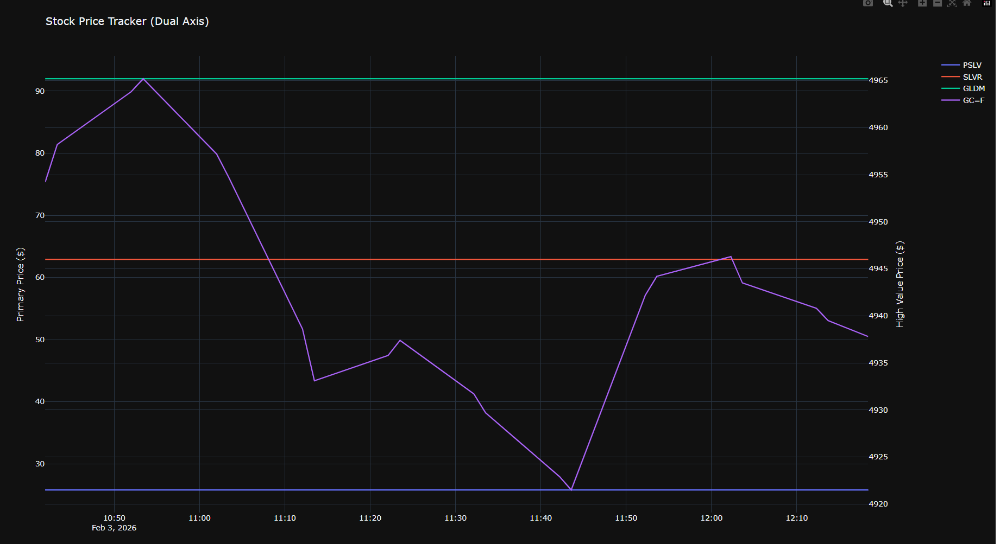

# Simple Stock Tracker



A lightweight, local self-hosted stock tracker that runs in the background. It monitors your favorite stocks (and Gold/Silver) and generates a self-updating HTML dashboard with interactive graphs.

## Features

-   **Live Monitoring**: Fetches prices every 10 minutes from Yahoo Finance.
-   **Dual-Axis Dashboard**: Automatically detects high-value assets (like Gold) and places them on a secondary Y-axis for readable graphs.
-   **CSV Persistence**: Saves all historical data to `stocks.csv` (Excel compatible).
-   **Configurable**: Just edit `tickers.csv` to add or remove stocks.
-   **Zero-Maintenance**: Runs in the background on Windows.

## Installation

1.  **Clone the repo** (or download the files).
2.  **Install Python** (if not installed).
3.  **Install dependencies**:
    ```bash
    pip install -r requirements.txt
    ```

## Usage

1.  **Edit Tickers**:
    Open `tickers.csv` and add the symbols you want to track.
    *Example:*
    ```csv
    Ticker,Name
    PSLV,Sprott Physical Silver
    GC=F,Gold Futures
    ```

2.  **Start Monitoring**:
    Double-click `run_tracker.bat`.
    *(A black window will open. Minimize it to keep it running).*

3.  **View Dashboard**:
    Open `dashboard.html` in your web browser. It will auto-refresh every 10 minutes.

## Contributing

Feel free to open issues or submit PRs if you want to improve the graph styles or CSV handling!

## License

MIT License. See [LICENSE](LICENSE) file.
